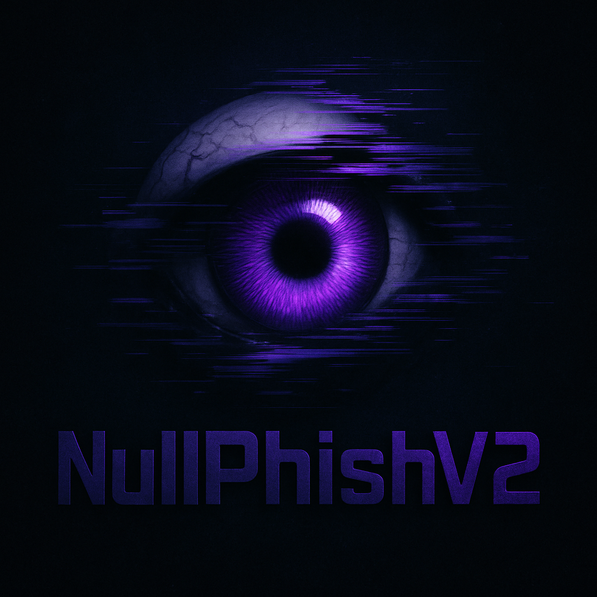

# NullPhish v2.2  

<p align="center">
  
</p>

**Copyright © 2025 Null Signal Network. Todos los derechos reservados.**

---

## AVISO LEGAL  
Este software y su código fuente están protegidos por leyes internacionales de derechos de autor. Está estrictamente prohibido sin permiso por escrito de los titulares:

- Distribuir, modificar o usar comercialmente  
- Ingeniería inversa o alteración del código  

Uso autorizado limitado a:  
Auditorías internas autorizadas  
Investigación profesional en ciberseguridad  
Formación técnica controlada  

Los desarrolladores no asumen ninguna responsabilidad por uso indebido o malicioso.

---

## Descripción Técnica  
NullPhish v2.2 es una herramienta profesional de phishing que incluye:

- Captura **real** de credenciales con registro detallado  
- Servidor HTTP embebido en Python  
- Túnel automático vía Cloudflare sin cuenta  
- Geolocalización extendida por IP (tres APIs combinadas)  
- Detección de VPN, proxy, Tor y IPs abusivas  
- Datos ASN enriquecidos (ISP, WHOIS, dominio, rango)  
- Mapa directo con coordenadas (Google Maps)  
- Selección automática de puerto libre  
- Menú interactivo para plantillas (Facebook / Instagram)  
- Consola enriquecida con arte ASCII y colorama  
- Autodetección de plataforma víctima (Windows, Android, iOS...)  
- Instalación automática de dependencias requeridas  
- Acortador de URLs integrado

---

## 🛠 Instalación Básica  

```bash
git clone https://github.com/DozerMx/NullPhish.git
cd NullPhish
python3 NullPhish.py
```

> Asegúrate de tener `cloudflared` instalado en tu sistema.  
> Si faltan dependencias, NullPhish puede instalarlas por ti automáticamente.

---

## 🛰 Ejemplo de salida en consola  

[*] NullPhish v2.2 - Phishing Tool
[*] Use responsibly for educational purposes only
[*] Created by: @DozerMx - Null Signal Network

------------------------------------------------------------
*             Información de la Víctima                  *
------------------------------------------------------------

[+] Fecha y Hora: 2025-07-21 03:33:47
[+] IP: 186.28.xxx.xxx

-------------------- UBICACIÓN --------------------
[+] País: Colombia
[+] Región: Bogotá D.C.
[+] Ciudad: Bogotá
[+] Código Postal: 111111
[+] Zona Horaria: America/Bogota
[+] Coordenadas: 4.6097,-74.0817
[+] Mapa: https://www.google.com/maps?q=4.6097,-74.0817

---------------- INFORMACIÓN DE RED ----------------
[+] ISP: Claro Colombia
[+] ASN: AS10620
[+] Proxy: No
[+] VPN: No
[+] Tor: No
[+] Abuser: No

---------------- DATOS ECONÓMICOS ----------------
[+] Moneda: COP
[+] Tasa de Cambio: 3924.52

---------------- CREDENCIALES ----------------
[+] Correo/Usuario: victima@gmail.com
[+] Contraseña: password123

----------- INFORMACIÓN DEL DISPOSITIVO -----------
[+] User-Agent: Mozilla/5.0 (Linux; Android 13; ...)
[+] Plataforma: Android

[*] Credenciales capturadas
[*] Ruta de almacenamiento: /.../NullPhish/credentials.txt
------------------------------------------------------------

---

## Licencia  

El acceso al código no implica derechos de uso. Está prohibido:

- Redistribuir o vender el código
- Modificar con fines maliciosos
- Usar sin consentimiento de terceros

Para permisos específicos, contactar al equipo legal de **Null Signal Network**.

*El logo y marca son propiedad exclusiva de Null Signal Network.*

---

## Autor  

- Desarrollado por: **DozerMx**
- Proyecto de: **Null Signal Network**
- GitHub: https://github.com/DozerMx

---

👾NullPhish v2.2👾
